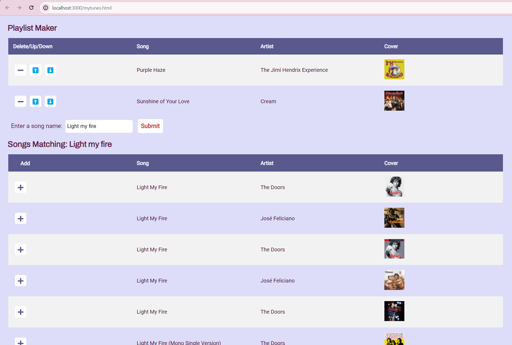

# Playlist-Maker
A simple web app that allows you to search up and create playlists using iTunes Search API

How To Run:
1. Requires node.js/npm
2. To install dependencies, in the terminal of the main directory, enter:
     npm install
3. To run the server, in the terminal of the main directory, enter the following:
      node server.js
   Follow the links provided in the terminal or enter the following in the browser:
      http://localhost:3000/mytunes.html

Preview:

